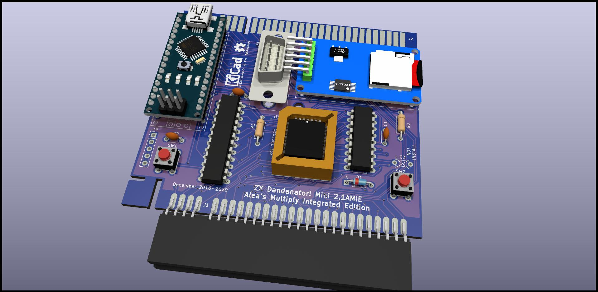
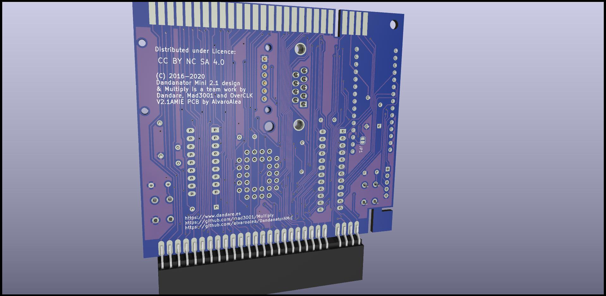

# ZX Dandanator with Multiply Addon all in one
## Alea's Multiply Integrated Edition

UNDER LICENSE Creative Commons Attribution-NonCommercial-ShareAlike 4.0 International (CC BY-NC-SA 4.0)
- If you remix, transform, or build upon the material, you must distribute your contributions under the same license as the original.
- You may not use the material for commercial purposes.
- You must give appropriate credit, provide a link to the license, and indicate if changes were made. You may do so in any reasonable manner, but not in any way that suggests the licensor endorses you or your use.

Original Desing by Dandare, mad3001 and OverClk

PCB Desing of the V2.1AMIE edition by AlvaroAlea

This is a project to integrate in only one PCB (well, in three) the ZX Dandanator Cartridge for ZX Spectrum and the Multiply Addon.

Check the father projects:

http://www.dandare.es

https://github.com/mad3001/Multiply

## Features

* 512Kb of flash memory for zero seconds load of games with a fancy menu

* microSD Card Slot for load of snapshots (Z80 and SNA) and tape files, also to program the flash memory

* microUSB conection for transfer flash memory from PC to Dandanator

* A multi-protocol Joystick conector that provide a Kempston Interface and allow to use any atari, SJS, or megadrive joystick with any ZX Spectrum

